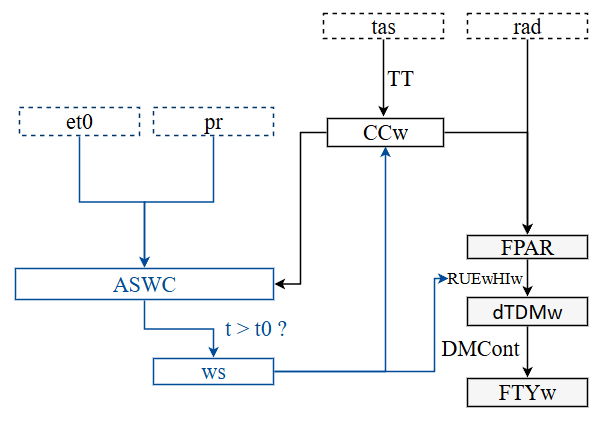
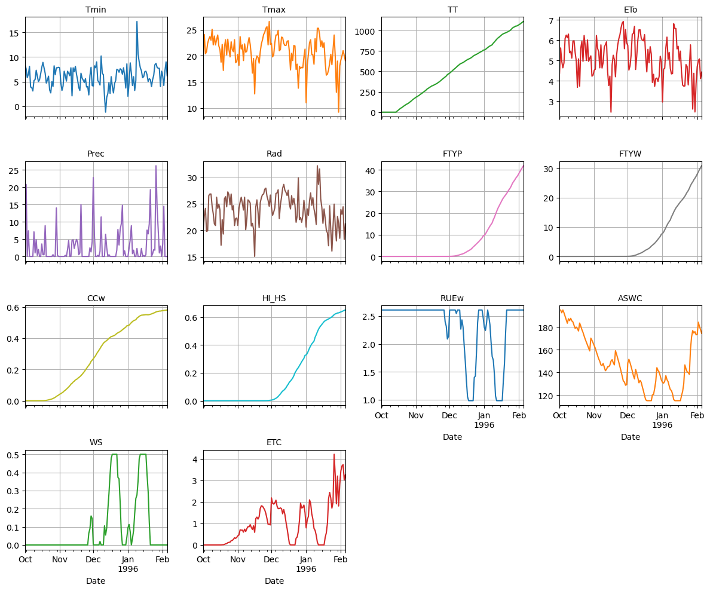

[](https://doi.org/10.5281/zenodo.17388068)

<!--  -->
<!--  -->

<div align="center">
  
</div>

<!--  -->

# SOLANUM Crop Model

<!-- **Author:** Marcelo Bueno Dueñas  
**Date:** 2025-10-18 -->

---

SOLANUM is a potato crop model modified from LINTUL-POTATO and adapted for Andean conditions. It requires daily agrometeorological data (precipitation, minimum and maximum temperature, solar radiation, and potential evapotranspiration), soil parameters (field capacity, permanent wilting point and soil depth), and environmental variables such as atmospheric CO₂ concentration. The model is capable of estimating tuber yield under water stress, frost, variations in atmospheric CO₂ concentration, and thermal stress.

The model operates with daily time steps and performs iterative calculations in the following order:  
1. Foliage growth and biomass accumulation  
2. Percolation  
3. Evapotranspiration  
4. Water balance update  
5. Effect of water availability on evapotranspiration  
6. Final update of biomass and foliage  

The following figure shows the general diagram of the SOLANUM model:



---


## Repository Structure

```text
py_solanum/
│
├── solanum/
│   ├── __init__.py
│   ├── parameters.py
│   ├── climate.py
│   ├── stress.py
│   ├── canopy.py
│   ├── water.py
│   ├── model.py
│   └── utils.py
│
├── example/
│   ├── test_clim_data.csv
│   └── params.json
│
└── solanum_run.py
```

## Instalation requirements 


You can install the dependencies with:

```bash
pip install -r requirements.txt
```

## Run Solanum

Open your terminal and run:

```bash
git clone https://github.com/kundun14/py_solanum.git
```

To test the model with a sample dataset, navigate to the repository root and run:

```bash
python solanum_run.py
```

After runing the SOLANUM model, you could plot the results:




To cite pySolanum

```bibtex
@software{BuenoDuenas2025,
  author       = {Marcelo Bueno Dueñas},
  title        = {pySolanum: A Python implementation of the SOLANUM potato crop model for Andean conditions},
  version      = {1.0.0},
  year         = {2025},
  publisher    = {Zenodo},
  doi          = {10.5281/zenodo.17388068},
  url          = {https://doi.org/10.5281/zenodo.17388068}
}
```

## Model Structure

This document presents the main equations of the model, the biomass dynamics, and the soil water balance, as well as the indices related to stress and water use efficiency.

---

## Biomass Accumulation

The growth rate of a well-watered crop is proportional to the absorbed light and the net assimilation rate. Daily dry matter accumulation is simulated as:

$$
dTDM_w = \frac{RUE_w \cdot CC_w \cdot PAR}{100} \cdot HI_w
$$

Where:

- `dTDM_w`: net assimilation rate of dry matter (t ha⁻¹ day⁻¹)  
- `PAR`: photosynthetically active radiation (MJ m⁻²), calculated as `PAR = Rs × 0.5`  
- `RUE_w`: radiation use efficiency adjusted for stress  
- `CC_w`: canopy cover adjusted by water stress  
- `HI_w`: tuberization index (fraction of assimilates allocated to the tuber)  

Total accumulated biomass:

$$
DTY_w = \int_{TT=0}^{TT=n} dTDM_w \, dt
$$

Fresh yield:

$$
FTY_w = \frac{DTY_w}{DMContent}
$$

---

## Effect of CO₂ Concentration

The relative effect of CO₂ on radiation assimilation efficiency:

- If `CO2AirConcent < 330`:  
  $CO2relatEffect = 0.0031 \cdot CO2AirConcent + 0.0093$  
- If `330 ≤ CO2AirConcent < 880`:  
  $CO2relatEffect = 0.0007 \cdot CO2AirConcent + 0.79$  
- If `CO2AirConcent ≥ 880`:  
  $CO2relatEffect = 0.000008 \cdot CO2AirConcent + 1.4223$  

Radiation use efficiency adjusted for CO₂:

- If `CO2relatEffect ≥ 1.5`:  
  $RUE_{CO2} = RUE_w \cdot 1.5$  
- If `CO2relatEffect < 1.5`:  
  $RUE_{CO2} = RUE_w \cdot CO2relatEffect$  

---

## Development and Tuberization

Thermal time accumulation:

$$
TT_i = TT_{i-1} + k \cdot (T_a - T_{base}), \quad T_a = \frac{T_{min} + T_{max}}{2}
$$

### Canopy Cover (CC)

Leaf expansion:

$$
canopy = w_{max} \cdot \exp\Big(-\frac{t_m}{TT} \cdot PDEN\Big) 
\cdot \Big(1 + \frac{t_e - TT}{t_e - t_m}\Big) \cdot \frac{TT}{t_e} \cdot \frac{t_e}{t_e - t_m}
$$

Adjusted canopy cover:

$$
CC_w = CC \cdot \frac{0.75 - W_s}{0.75}
$$

### Tuberization

Harvest index (Gompertz function):

$$
HI = A \cdot \exp\Big(-\exp\big(\frac{TT - t_u}{b}\big)\Big)
$$

---

## Water Processes

Water balance:

$$
ASWC_i = ASWC_{i-1} + P_i + I_i - E_0 - T - D
$$

Potential transpiration:

$$
T_0 = \frac{w_{max} \times ET_0 \times (1 - e^{-0.7\cdot 4 \cdot CC_w})}{1 - e^{-0.7\cdot 4 \cdot w_{max}}}
$$

Potential evaporation:

$$
E_0 = ET_0 - T_0
$$

Discrete soil water update:

- If $P_i + I_i + ASWC_{i-1} - E_{0,i-1} - T_i \le WP$: $ASWC_i = WP$  
- If $P_i + I_i + ASWC_{i-1} - E_{0,i-1} - T_i \ge FC$: $ASWC_i = FC$  
- Otherwise: $ASWC_i = P_i + I_i + ASWC_{i-1} - E_{0,i-1} - T_i$

Actual transpiration:

- If `ASWC_i < WP`: $T = 0$  
- If `WP ≤ ASWC_i ≤ CL`: $T = T_0 \cdot \frac{WP - ASWC_i}{WP - CL}$  
- If `ASWC_i > CL`: $T = T_0$

---

## Water Stress Index (Ws)

- If `T_i > 0.5 × T_0`: $W_s = 0$  
- If `T_i ≤ 0.5 × T_0`: $W_s = \frac{0.5 \cdot T_0 - T_i}{T_0}$  

---

## Output Variables

- Fresh tuber yield (`FTY_w`)  
- Total accumulated evapotranspiration (`ΣET`)  
- Daily water balance (`ASWC`) and stress status (`Ws`)  
- Total water requirement for the season: `WR = ΣT`  

Water Use Efficiency (WUE):

$$
WUE_{ET} = \frac{FTY_w}{\sum ET}
$$

Normalized Water Stress Index (WSI):

$$
WSI = 1 - \frac{\sum T}{\sum T_0}
$$

---

## Parameters of the SOLANUM Model

| Symbol      | Full Name                                  | Unit                |
|------------|-------------------------------------------|-------------------|
| EDay       | Day of emergence                           | days              |
| plantDensity | Plant density                             | plants/m²         |
| Wmax       | Maximum canopy cover index                 | --                |
| tm         | TT at maximum canopy growth                | °Cd               |
| te         | TT at maximum canopy cover value           | °Cd               |
| A          | Maximum harvest index                       | --                |
| tu         | TT at maximum tuber partition index        | °Cd               |
| b          | TT before the onset of tuberization       | °Cd               |
| RUE        | Radiation use efficiency                    | g MJ PAR⁻¹       |
| DMC        | Tuber dry matter content                    | --                |
| Tb         | Minimum temperature for tuberization       | °C                |
| To         | Optimum temperature for tuberization       | °C                |
| Tu         | Maximum temperature for tuberization       | °C                |
| Pc         | Critical photoperiod                        | h                 |
| w          | Photoperiod sensitivity                     | --                |
| Tcr        | Lower critical temperature                  | °C                |
| Tld        | Lower limit of lethal cold damage           | °C                |
| Trg        | Temperature of rapid cold death             | °C                |
| zsoil      | Soil depth                                  | m                 |
| Ho         | Initial soil water content                  | mm                |
| FC         | Volumetric water content at field capacity | %                 |
| PWP        | Volumetric water content at wilting point  | %                 |
| CO2AC      | CO₂ concentration in the air                | ppm               |

---

## References
1. Allen, R. G., et al. (1998). *Crop evapotranspiration — Guidelines for computing crop water requirements.* FAO Irrigation and Drainage Paper 56. [Link](http://www.fao.org/docrep/X0490E/X0490E00.htm)  
2. Condori, B., et al. (2010). *Quantifying the expression of potato genetic diversity in the high Andes through growth analysis and modeling.* Field Crops Research, 119(1), 135–144.  
3. Condori, B., et al. (2008). *Agrophysiological characterisation and parametrisation of Andean tubers.* European Journal of Agronomy, 28(4), 526–540.  
4. Hijmans, R. J. (2003). *The effect of climate change on global potato production.* American Journal of Potato Research, 80(4), 271–279.  
5. Quiroz, R., et al. (2018). *Impact of climate change on the potato crop and biodiversity in its center of origin.* Open Agriculture, 3(1), 273–283.  
6. Fleisher, D. H., Condori, B., Quiroz, R., Alva, A., Asseng, S., Barreda, C., Bindi, M., Boote, K. J., Ferrise, R., Franke, A. C., Govindakrishnan, P. M., Harahagazwe, D., Hoogenboom, G., Naresh Kumar, S., Merante, P., Nendel, C., Olesen, J. E., Parker, P. S., Raes, D., ... Woli, P. (2017). A potato model intercomparison across varying climates and productivity levels. Global Change Biology, 23(3), 1258-1281. https://doi.org/10.1111/gcb.13411 
7. Haverkort, A. J., & Harris, P. M. (1987). *A model for potato growth and yield under field conditions.* Netherlands Journal of Agricultural Science, 35, 273–286.  
8. Kooman, P. L., & Haverkort, A. J. (1995). *Modeling development and growth of the potato crop influenced by temperature and daylength: LINTUL-POTATO.*  
9. Spitters, C. J. T., & Schapendonk, A. H. C. M. (1990). *Evaluation of breeding strategies for drought tolerance for potato by means of crop growth simulation.* Plant and Soil, 123, 193–203.
